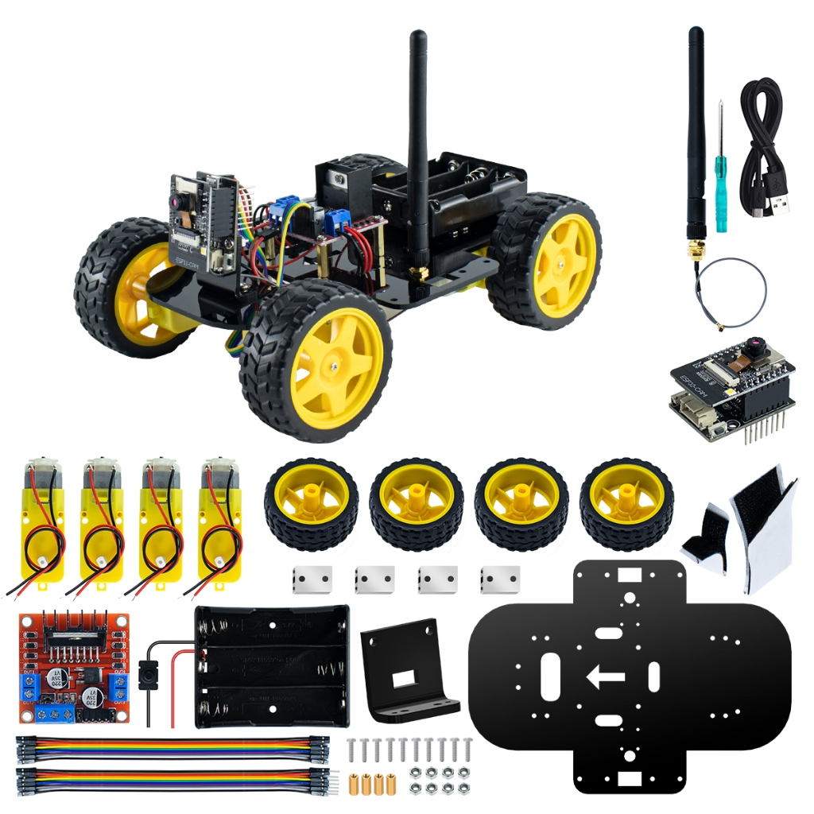

## Sobre o Projeto
Projeto de robótica que ensina a montar um carrinho com Arduino, motores DC e controle básico. Ideal para introdução à programação embarcada.

## Passo a Passo
### Passo 1: Montar a estrutura
Fixe os motores na base do carrinho utilizando parafusos.

### Passo 2: Conectar Arduino
Ligue o driver de motores ao Arduino e aos motores.

### Passo 3: Programar o Arduino
Envie o código de controle básico para movimentação.

### Passo 4: Testar movimentos
Verifique se o carrinho se move corretamente para frente e trás.

