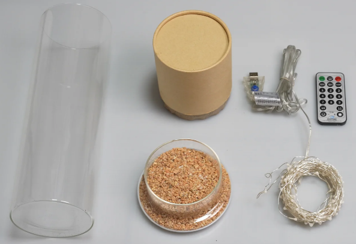
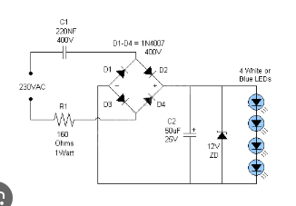

## Sobre o Projeto
Este projeto ensina a criar uma luminária decorativa utilizando um pote de vidro e LEDs. Ideal para iniciantes, aborda conceitos básicos de circuito elétrico, reaproveitamento de materiais e montagem simples.

## Passo a Passo
### Passo 1: Preparar os materiais
Separe o pote de vidro, fita de LED, pilhas, suporte de bateria e fios.

### Passo 2: Montar o circuito
Conecte a fita de LED ao suporte de pilhas respeitando polaridade.

### Passo 3: Inserir no pote
Coloque o circuito dentro do pote e organize os fios.

### Passo 4: Testar funcionamento
Ligue o sistema e verifique se os LEDs acendem corretamente.

