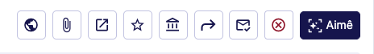
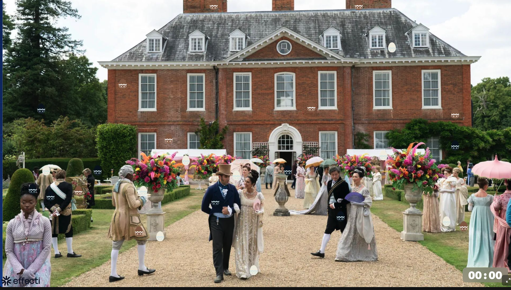

## Sobre o Projeto
Esse é um teste para validar o projeto

## Passo a Passo
### Passo 1: Passo 1 -
descrição do passo 1 

<a href="/projetos/projeto-novo/2e66a835-b35c-45a1-931c-e79a2d7c42f6.pdf" download style="display:inline-flex; align-items:center; gap:8px; background:#166534; color:white; padding:10px 20px; border-radius:8px; font-size:0.875rem; font-weight:600; text-decoration:none; margin:12px 0;">⬇️ Baixar arquivo (2e66a835-b35c-45a1-931c-e79a2d7c42f6.pdf)</a>

### Passo 2: Passo 2
passo dois descrição

<a href="/projetos/projeto-novo/Atestado.pdf" download style="display:inline-flex; align-items:center; gap:8px; background:#166534; color:white; padding:10px 20px; border-radius:8px; font-size:0.875rem; font-weight:600; text-decoration:none; margin:12px 0;">⬇️ Baixar arquivo (Atestado.pdf)</a>

### Passo 3: passo 3 
sEm nada

